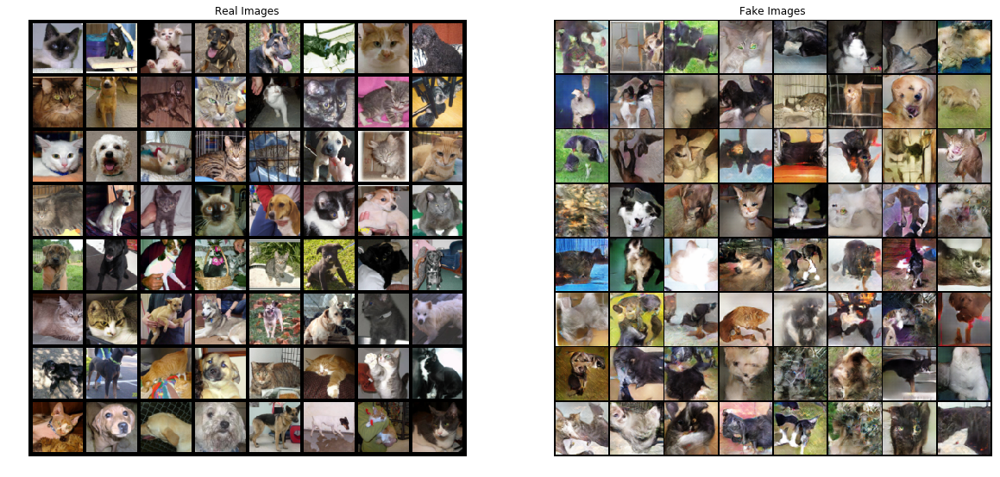
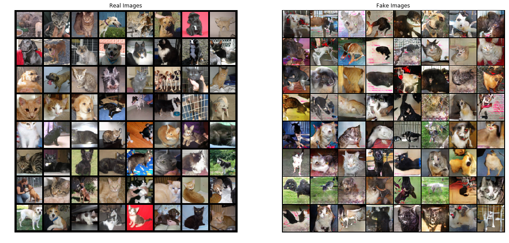

# Generative Adversarial Nerworks / GANs

Here, I present a Deep Convolutional GAN. Code is based on the [paper](https://arxiv.org/pdf/1511.06434.pdf)
'Unsupervised representation learning with deep convolutional generative adversarial networks'. In this case,
I tried to generate CIFAR-10 imagen categories dataset and apart dogs and cats. Dataset for dogs and cats was obtained from 'Dogs vs cats' kaggle competition and whole dataset was used (train & test). 

In DCGAN_spanishCommented.py both some theory of GANs and each line of code are explained. I have trained the NN with CPU for 25 epochs and results are not good at all. After that I trained the net in an AWS GPU for 200 epochs and results looked 
better but far from real images. Even so, comparing the first and last epoch, differences are really appreciable. Results from CIFAR-10 are in 'CIFAR_10' folder, from 0 to 24 epoch and results from dogs and cats are in 'Dog_cat' folder.    

If you want to train in a GPU I recommend you to do it with this [code](https://pytorch.org/tutorials/_downloads/dc0e6f475c6735eb8d233374f8f462eb/dcgan_faces_tutorial.py)
from [Pytorch tutorials](https://pytorch.org/tutorials/beginner/dcgan_faces_tutorial.html)

Aquí presento una Deep Convolutional GAN. El código se basa en el [paper](https://arxiv.org/pdf/1511.06434.pdf)
'Unsupervised representation learning with deep convolutional generative adversarial networks'. En este caso, traté de generar imágenes de las categorías del dataset CIFAR-10 y aparte además perros y gatos. El dataset para perros y gatos se obtuvo de la competición de Kaggle 'Dogs vs cats' y se usó el dataset completo (train & test).

En DCGAN_spanishCommented.py se explican cada línea de código lo que sirve para comprender las GANs. He entrenado a la NN con CPU durante 25 épocas y los resultados no son buenos en absoluto. Después de eso, entrené la red en una GPU de AWS durante 200 épocas y los resultados se veían mejor, pero lejos de las imágenes reales. Aun así, comparando la primera y la última época, las diferencias son realmente apreciables. Los resultados de CIFAR-10 están en la carpeta 'CIFAR_10', de 0 a 24 veces y los resultados de perros y gatos están en la carpeta 'Dog_cat'.

Si quieres entrenar en una GPU, te recomiendo que lo hagas con este [código](https://pytorch.org/tutorials/_downloads/dc0e6f475c6735eb8d233374f8f462eb/dcgan_faces_tutorial.py)
del [tutorial de Pytorch](https://pytorch.org/tutorials/beginner/dcgan_faces_tutorial.html)

**Result from CIFAR-10 - 25 epochs**

**Result from Dogs and cats - 192 epochs, batch 128 **

**Result from Dogs and cats - 200 epochs, batch 64**

 
