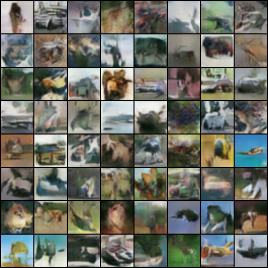

# Generative Adversarial Nerworks / GANs

Here, I present a Deep Convolutional GAN. Code is based on the [paper](https://arxiv.org/pdf/1511.06434.pdf)
'Unsupervised representation learning with deep convolutional generative adversarial networks'. In this case,
I tried to generate CIFAR-10 categories dataset and apart dogs and cats. Dataset for dogs and cats was obtained from 'Dogs vs cats' kaggle competition and whole dataset was used (train & test). 

In DCGAN_spanishCommented.py both some theory of GANs and each line of code are explained. I have trained the NN with CPU for 25 epochs and results are not good at all. After that I trained the net in an AWS GPU for 200 epochs and results looked 
better but far from real images. Even so, comparing the first and last epoch, differences are really appreciable. Results from CIFAR-10 are in 'results' folder, from 0 to 24 epoch and results from dogs and cats are in Dog_cat folder.    

If you want to train in a GPU I recommend you to do it with this [code](https://pytorch.org/tutorials/_downloads/dc0e6f475c6735eb8d233374f8f462eb/dcgan_faces_tutorial.py)
from [Pytorch tutorials](https://pytorch.org/tutorials/beginner/dcgan_faces_tutorial.html)

 
